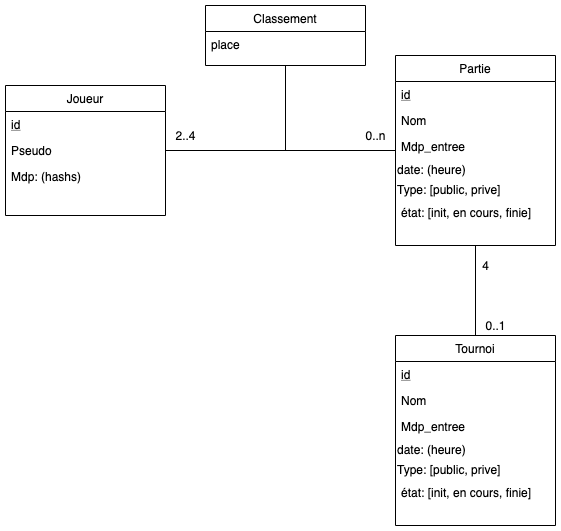
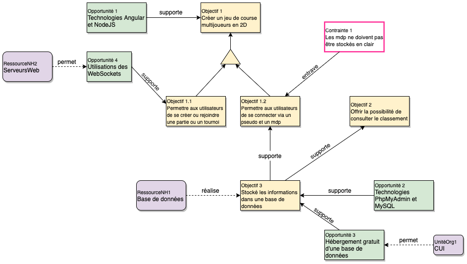
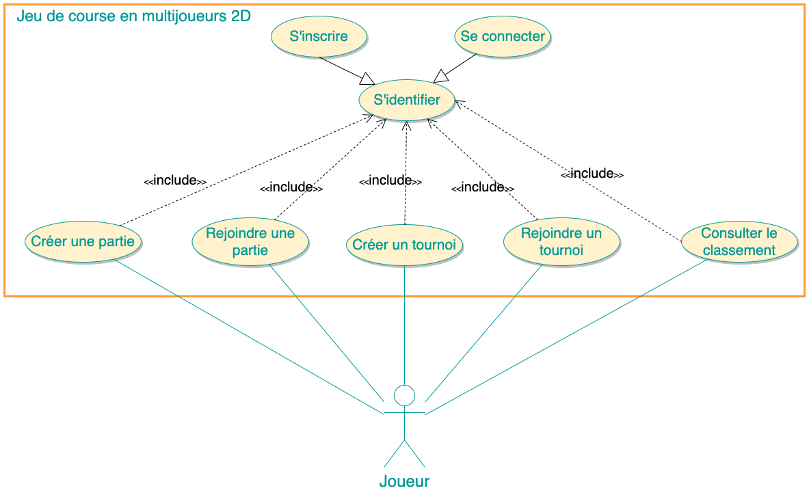
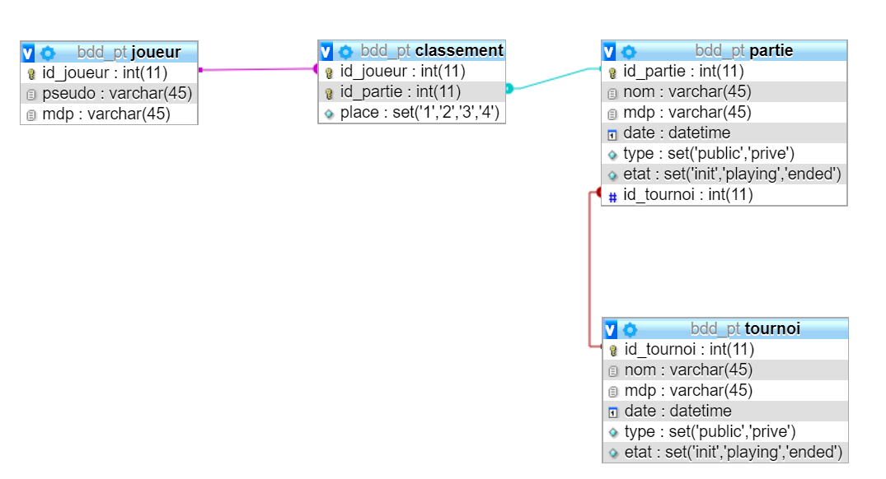

# Projet Transverse I
Jeu de course multijoueurs en 2D 

# draw.io links
* [Graph de la bdd](https://www.draw.io/#G1HM3u5Jm_DHEvWb5QuPT6elJKHJPSvnr9)
* [Modèle des objectifs](https://www.draw.io/#G1pc2gVNvSXj_uxWbKKBlU1y9g3dyHINHV) 
* [Use Case](https://tinyurl.com/sykt2lp)

# Schémas
## Schéma de la base de données

## Schéma des objectifs

## Use Case

## Schéma de la base de données SQL

