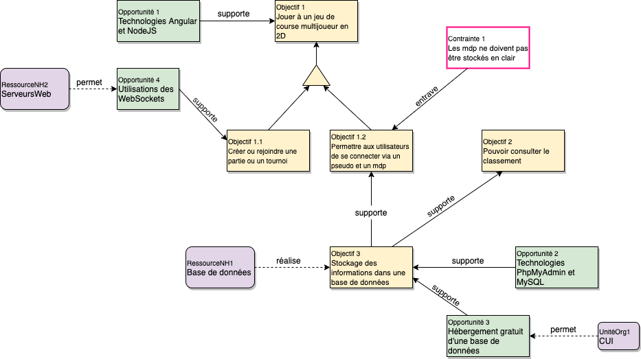

# Projet Transverse I
Jeu de course multijoueurs en 2D.

# draw.io links
* [Graph de la bdd](https://www.draw.io/#G1HM3u5Jm_DHEvWb5QuPT6elJKHJPSvnr9)
* [Modèle des objectifs](https://www.draw.io/#G1pc2gVNvSXj_uxWbKKBlU1y9g3dyHINHV) 
* [Use Case](https://tinyurl.com/sykt2lp)

# Tutorials
* [Tuto socket.io/angular/nodejs](https://www.thepolyglotdeveloper.com/2019/04/using-socketio-create-multiplayer-game-angular-nodejs/)
* [Tuto browser game](https://medium.com/hackernoon/how-to-build-a-multiplayer-browser-game-4a793818c29b)
* [Tuto le plus utile"utile"](https://www.dynetisgames.com/2017/03/06/how-to-make-a-multiplayer-online-game-with-phaser-socket-io-and-node-js/)

# Schémas
## Schéma de la base de données

## Schéma des objectifs

## Use Case

## Schéma de la base de données SQL

